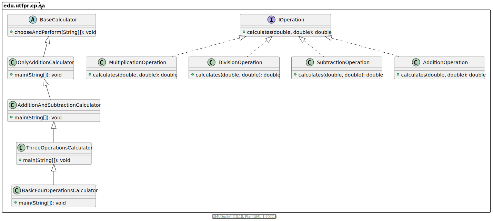
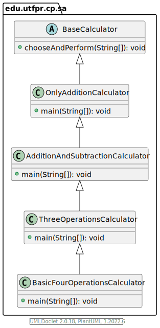

# Extensible Calculator - Functional Interface 
This project improves the [Open-Closed calculator](https://github.com/gabrielcostasilva/sa-calc/tree/open-closed) implementation by using [functional interfaces](https://www.baeldung.com/java-8-functional-interfaces).

As the previous project, I use it in the Software Architecture module I teach at [Universidade Tecnológica Federal do Paraná, Cornélio Procópio, Brasil](http://www.utfpr.edu.br/campus/cornelioprocopio) for Software Engineering graduate students. 

## Project Overview
The `IOperation` interface was the underlying element for creating an extensible calculator. This creates an entire new set of classes, as the UML class diagram below illustrates. 



On the one hand, this strategy separates concerns, creating a single implementation for each arithmetic operation. On the other hand, the `IOperation` interface has one single method, turning this class into a functional interface.

Therefore, we can easily simplify this project by replacing `IOperation` with Java `java.util.function.ToDoubleBiFunction` in the [`BaseCalculator`](./src/main/java/edu/utfpr/cp/sa/BaseCalculator.java.java).

The code below fully shows the new implementation of `BaseCalculator`.

```java 
public abstract class BaseCalculator {

    Map<Character, ToDoubleBiFunction<Double, Double>> operationMap; // (1)

    BaseCalculator() {
        operationMap = new HashMap<>();

    }

    public void chooseAndPerform(String[] args) {
        double a = Double.parseDouble(args[0]);
        double b = Double.parseDouble(args[2]);

        char op = args[1].charAt(0);

        double result = operationMap.get(op).applyAsDouble(a, b); // (2)

        System.out.println(result);
    }

}
```

Nothing has changed, apart from (1) and (2). First, `operationMap` maps a `char` and a `java.util.function.ToDoubleBiFunction`, instead of `IOperation`. `java.util.function.ToDoubleBiFunction` accepts two arguments as defined in its instantiation, and returns a `double` value - as seen in (1).

Second, in (2), we replace the `IOperation` method with `java.util.function.ToDoubleBiFunction`. `applyAsDouble(a, b)` calls the execution of an `java.util.function.ToDoubleBiFunction` implementation. 

The last step is replacing the `IOperation` implementation in `BaseCalculator` subclasses. The code below shows the [`OnlyAdditionCalculator`](./src/main/java/edu/utfpr/cp/sa/OnlyAdditionCalculator.java) as an exemple.

The figure below shows a simpler class structure.



```java
public class OnlyAdditionCalculator 
    extends BaseCalculator {

    OnlyAdditionCalculator() {
        operationMap.put('+', (a, b) -> a + b); // (1)
        
    }

    public static void main(String[] args) {
        var calc = new OnlyAdditionCalculator();
        calc.chooseAndPerform(args);
    }
    
}
```

In (1), we replace the instantiation of `IOperation` with a lambda that adheres to the functional interface we use.

## Project Setup
This project requires Maven and Java 17 installed. The easiest way to run the project is building a package.

Within the project folder, type and run: `mvn clean package`. This will generate the `target` folder with a compiled `jar` file.

To try out the app, type and run: `java -jar target/calculator-1.0-SNAPSHOT.jar 1 + 2`

Please notice that the last three arguments represent the values and the operation that the calculator uses.

## Testing
This project features a [test class](./src/test/java/edu/utfpr/cp/sa/CalculatorTest.java) that asserts the implementation correctness. This project uses JUnit 5 for creating unit tests.

One can run all tests by typing and running: `mvn clean test`

